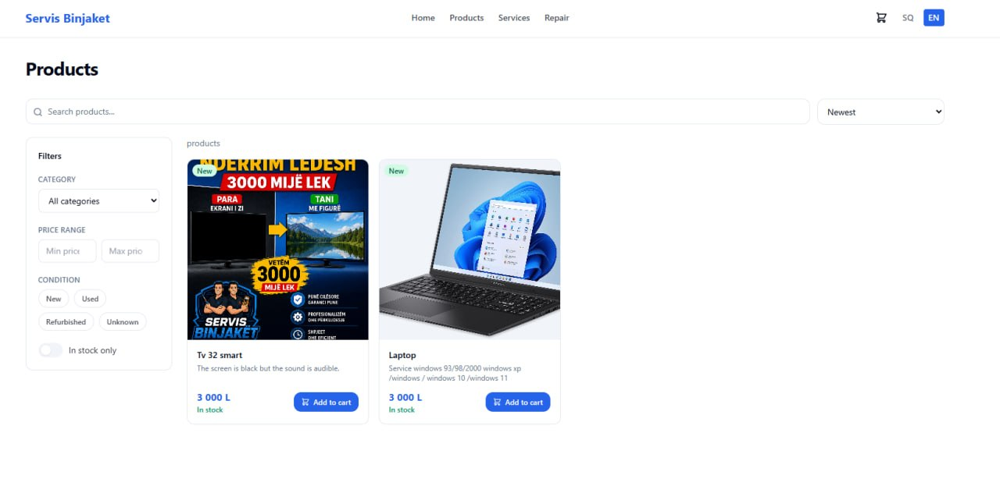
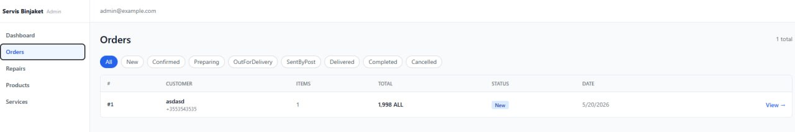
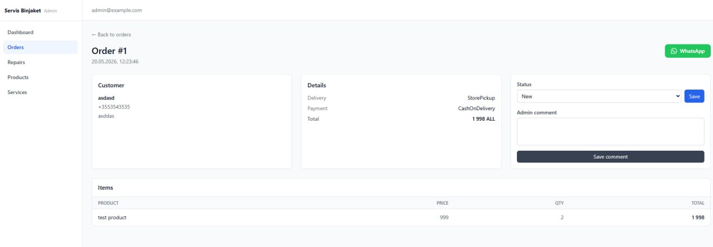

# Servis Binjaket

Albanian-first интернет-магазин электроники + сервис ремонта в Дурресе (Албания).

- **Frontend:** Next.js (App Router) · TypeScript · Tailwind · next-intl — локали `sq` / `en`
- **Backend:** ASP.NET Core Web API · EF Core · PostgreSQL
- **Infra:** Docker Compose · Nginx · Let's Encrypt

Live: [91.239.6.20](http://91.239.6.20/en/) (HTTP, VPS by IP — domain pending)

## Screenshots

| Storefront | Admin — orders | Admin — order detail |
|---|---|---|
|  |  |  |

---

## Локальный запуск

### Вариант 1 — Docker Compose (рекомендуется)

```bash
cp .env.example .env
# При необходимости отредактировать .env

docker compose up --build
```

| Сервис   | URL                                |
|----------|------------------------------------|
| Frontend | http://localhost:3000  (→ `/sq`)   |
| Backend  | http://localhost:5000/api/v1       |
| Swagger  | http://localhost:5000/swagger      |
| Postgres | localhost:5432                     |

### Вариант 2 — Раздельный запуск

**Postgres** (нужен Docker):

```bash
docker compose up -d postgres
```

**Backend:**

```bash
cd backend
dotnet restore
dotnet build
dotnet run --project src/ServisBinjaket.Api
```

**Frontend:**

```bash
cd frontend
npm install
npm run dev
```

---

## Тесты

```bash
# Backend unit + integration
cd backend && dotnet test

# Frontend type-check
cd frontend && npm run build
```

---

## Production deploy

Полная инструкция: [`docs/DEPLOYMENT.md`](docs/DEPLOYMENT.md)

### Быстрый старт (VPS, HTTP без домена)

```bash
# 1. Клонировать репо на VPS
git clone <repo-url> /opt/servis-binjaket
cd /opt/servis-binjaket

# 2. Настроить env (заполнить все change_me)
cp .env.example .env
nano .env

# 3. Запустить
docker compose -f docker-compose.prod.yml up -d --build

# 4. Проверить
curl http://<VPS_IP>/health
```

Сайт будет доступен по: `http://<VPS_IP>/`

### Переход на HTTPS (когда появится домен)

Пошаговая инструкция в [`docs/DEPLOYMENT.md`](docs/DEPLOYMENT.md) — раздел «Переход на HTTPS».

---

## Структура репозитория

```
backend/                  — ASP.NET Core solution (Clean Architecture)
frontend/                 — Next.js app (App Router + i18n)
nginx/nginx.conf          — Nginx reverse proxy (HTTP + закомментированный HTTPS)
scripts/backup-db.sh      — Backup базы данных
scripts/restore-db.sh     — Restore базы данных
docs/                     — Проектная документация
docker-compose.yml        — Локальная разработка
docker-compose.prod.yml   — Production
.env.example              — Шаблон переменных окружения
```
